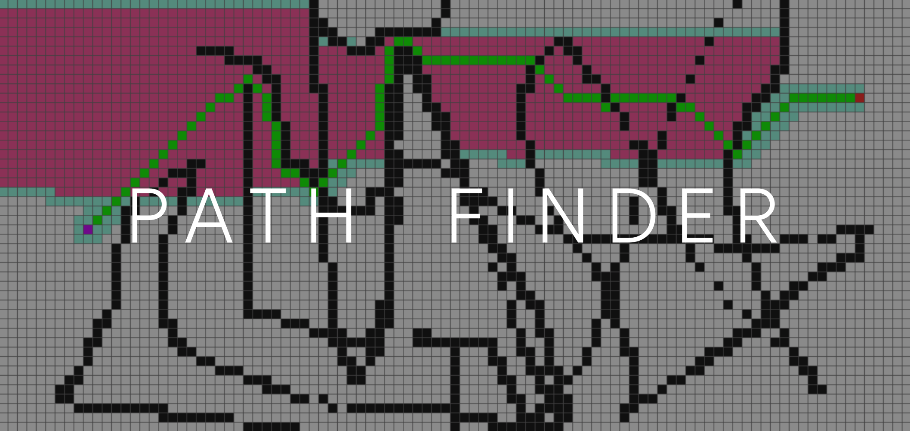
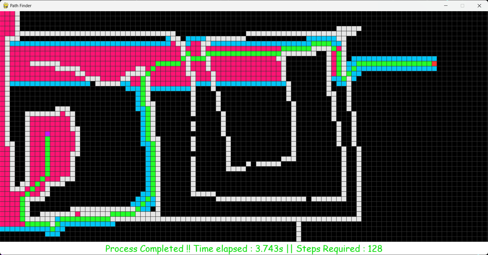
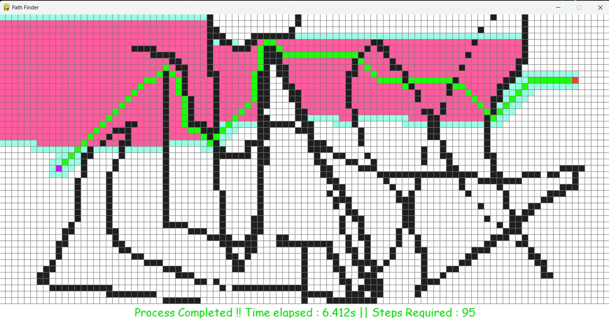
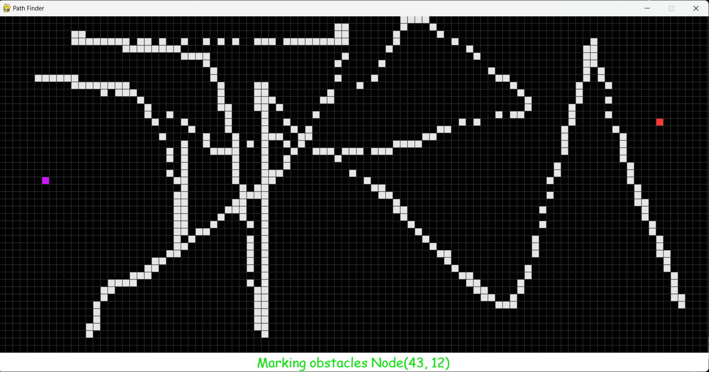
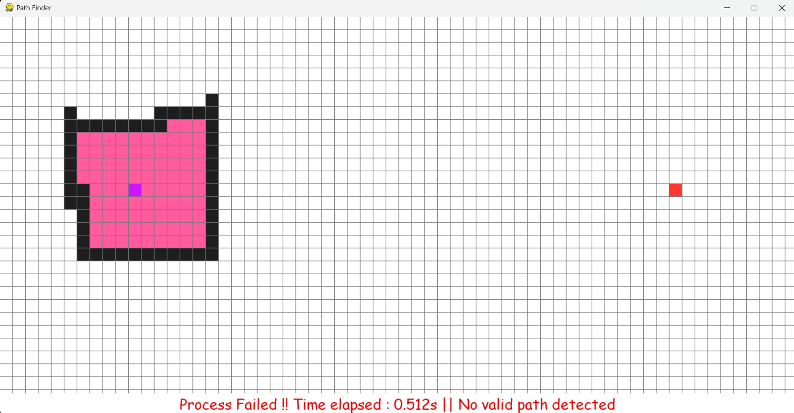
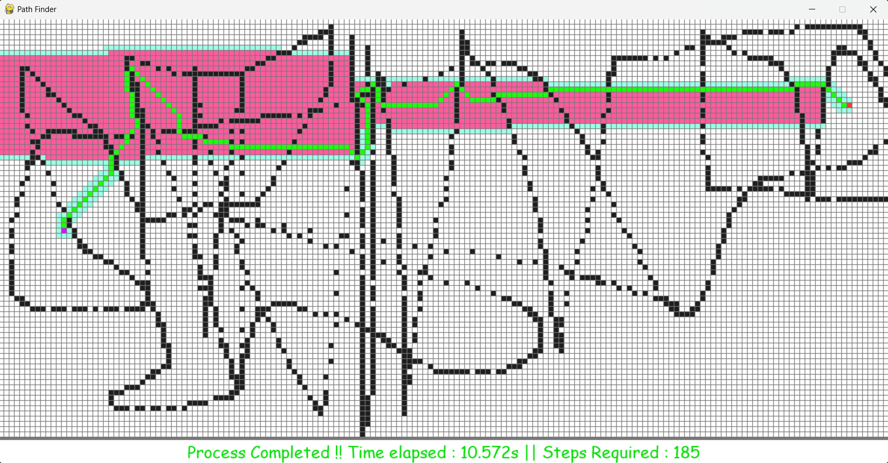

# A-Star Path Finding simulation

#### A graphical simulation of `Heuristic based A-Star Path Finding Algorithm` made with Pygame and Tkinter in python

##### [Demo on Youtube](https://youtu.be/awDPT-c7VUw)
###### See also 
[Sorting Algorithms Simulation](https://github.com/ChauhanRohan-RC/Sorting-Algorithms-Simulator.git)
[3D N*N Rubik's Cube solver-AI](https://github.com/ChauhanRohan-RC/Cube.git)  
[Fourier Series Simulation](https://github.com/ChauhanRohan-RC/Fourier-Series.git)  

## Algorithm
* The aim of the algorithm is to find the shortest path (path of least cost) from start to the end node, avoiding any obstacles in between
* Uses a _Heuristic-based A-Star path finding algorithm_
* Total cost function (heuristic) `f(n) = g(n) + h(n)`, where
  * `g(n)` : Cost of nth node from start node. Calculated as the manhattan distance of nth node from the start node
  * `h(n)` : Cost of nth node from end node. Calculated as the manhattan distance of nth node from the end node
  * `f(n)` : Total cost of nth node

## Features
* Colorful real-time Algorithm Tracking
* Configurable simulation parameters (see [config.ini](config.ini))
* Scale and Translate the simulation box
* Both pygame and tkinter implementation with the same backend
* Dark and Light themes

## Node Color Scheme
*  Idle
*  Obstacle
*  Start
*  End
*  Open
*  Closed

## Configurations
* To change simulation settings, edit [config.ini](config.ini)
* Supported parameters
  * `DarkMode` : 1 -> Enabled, 0 -> Disabled
  * `GRID_ROWS` : Number of rows        
  * `GRID_COLS` : Number of columns
  * `SideLength` : Side length of each node in pixels (integer)
  * `OutWidth` : Outline Width in pixels (floating point)
  * `VisualDelay` : algorithm delay in milliseconds
  * `DiagonalMove` : 1 -> Enabled, 0 -> Disabled

##  Controls
* `S` : Mark start node
* `E` : Mark end node
* `L-Click` : Mark obstacles (walls)
* `R-Click` : Delete obstacles
* `Enter` : Start the algorithm
* `CTRL-R` : Reset
* `Z / Scroll Up` : Zoom in
* `X / Scroll Down` : Zoom Out

## Usage
* Clone the repository   
`git clone https://github.com/ChauhanRohan-RC/PathFinder.git`

#### Python Usage
* To change Simulation settings, modify [config.ini](config.ini)
* Start Pygame simulation (Recommended)  
`python Visualizer_Pygame.py`
* Start Tkinter simulation  
`python Visualizer_Tk.py`

#### Windows Usage
* Navigate to [exe](exe) folder and extract [PathFinder.zip](exe/PathFinder.zip)
* To change Simulation settings, modify `config.ini`
* To start Pygame simulation (Recommended), run `Visualizer (Pygame).exe`
* To start Tkinter simulation, run `Visualizer (Tk).exe`

## Connect on
[GitHub](https://github.com/ChauhanRohan-RC)  
[Twitter](https://twitter.com/0rc_studio)  
[YouTube](https://www.youtube.com/channel/UCmyvutGWtyBRva_jrZfyORA)  
[Google Play Store](https://play.google.com/store/apps/dev?id=7315303590538030232)  
E-mail: com.production.rc@gmail.com

